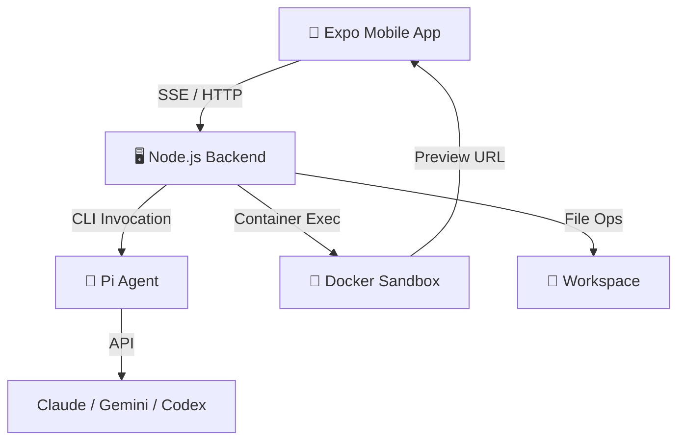
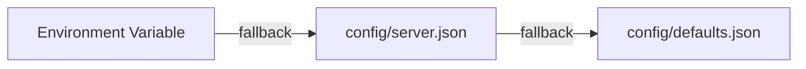

# Mobile Cocoa — Phase 1 Report

> **Project:** Mobile Cocoa  
> **Repository:** [synvo-ai/mobile-cocoa](https://github.com/synvo-ai/mobile-cocoa)  
> **Phase:** 1 — Foundation & Core Architecture  
> **Date:** March 1, 2026  

---

## 1. Tech Stack

The project is built as a **mobile-first intelligent coding assistant** utilizing the following technologies:

| Layer | Technologies |
|---|---|
| **Frontend / Mobile App** | React Native, Expo, TypeScript, TailwindCSS / Uniwind (styling), Reanimated (fluid animations) |
| **Backend Server** | Node.js, Express, Server-Sent Events (SSE) for real-time streaming |
| **Infrastructure & Execution** | Docker for containerization and sandboxing |
| **AI Integration** | Pi (CLI agent backend) integrating with LLMs — Claude (Anthropic), Gemini (Google), and Codex (OpenAI) |

---

## 2. Environment and Setup

The setup process establishes the local and remote development environments:

- **Prerequisites:** Requires Node.js, npm/yarn, Expo Go app (or iOS/Android simulator), and optionally Docker for secure sandboxed execution.

- **CLI Agent Installation:** The Pi CLI must be installed and authenticated with at least one coding plan (Claude, Gemini, or Codex).

- **Configuration:** The server utilizes JSON config files instead of `.env` files. Users copy `config/server.example.json` to `config/server.json` to customize settings like the port, default provider, and tunnel URLs.

- **Execution Scripts:**

  | Command | Purpose |
  |---|---|
  | `npm run dev` | Start the backend server locally |
  | `npm run dev:mobile` | Start the Expo mobile app |
  | `npm run dev:cloudflare` | Establish Cloudflare tunnel for remote access |

- **Remote Access:** A Cloudflare tunnel can be established to connect the mobile app from outside the local network (e.g., via `npm run dev:cloudflare` and running the mobile app with the tunnel URL).

---

## 3. Architecture Overview

The architecture is designed to support a robust, mobile-first AI development environment.

### 3.1 Client-Server Split

The system is split between an **Expo mobile application** and a **Node.js backend server**.

### 3.2 Mobile App Structure

The frontend source code is organized by feature/domain:

```
apps/mobile/src/
├── components/     # UI components (chat, file, preview)
├── core/           # Domain types and interfaces
├── services/       # Business logic (SSE, file operations)
└── theme/          # Centralized styling and design tokens
```

### 3.3 Skill-Driven Development

The architecture includes specialized standard operating procedures ("skills" such as UI/UX pro max, docker-expert, and systematic-debugging) to execute complex tasks efficiently without typing boilerplate code on mobile.

### 3.4 Concurrent Sessions

The system supports **unlimited concurrent AI development sessions**, limited only by the provider's API quotas.

### 3.5 Docker Integration

Commands and applications are sandboxed and tested within Docker containers to keep the host environment clean and safe.

### 3.6 Browser Preview

The system supports built-in browser previews for real-time visual feedback on web apps and UI components being built.



---

## 4. Advanced Design Patterns Implemented

Several robust design patterns have been established to ensure stability, performance, and security.

### 4.1 Config System

Employs a **three-layer fallback chain** with strict coercion helpers that fail fast at startup if required values are missing.



> [!IMPORTANT]
> Strict coercion helpers ensure the server fails fast at startup if any required configuration value is missing, preventing silent misconfiguration in production.

### 4.2 SSE Retry Logic

Uses **exponential backoff**, abort guards, and stale-retry cleanup to handle network failures and session switches gracefully without creating zombie connections.

| Mechanism | Purpose |
|---|---|
| Exponential Backoff | Prevents thundering-herd reconnection storms |
| Abort Guards | Cancels in-flight requests on session switch |
| Stale-Retry Cleanup | Disposes of lingering retries from previous sessions |

### 4.3 Slim Replay

Filters and strips heavy JSONL history snapshot events **before** parsing them, preserving mobile memory during session reconnects.

> [!TIP]
> By stripping heavyweight events pre-parse, Slim Replay significantly reduces peak memory usage on resource-constrained mobile devices during reconnection.

### 4.4 LRU Session Cache

Limits the number of cached sessions (e.g., to **15**) and evicts the oldest sessions to prevent unbounded memory growth on the mobile client.

### 4.5 Security — Path Validation

Enforces a `WORKSPACE_ALLOWED_ROOT` prefix check before any file operation, providing defense-in-depth against directory traversal and sandbox escapes.

> [!CAUTION]
> All file operations are gated by a `WORKSPACE_ALLOWED_ROOT` prefix check. This is a critical security boundary — bypassing it would expose arbitrary file system access.

### 4.6 State Management Optimization

Zustand state setters use **strict equality checks** (e.g., field-by-field comparators) to suppress unnecessary React re-renders during 3-second server polling intervals.

---

## 5. Phase 1 Summary

| Milestone | Status |
|---|---|
| Mobile app foundation (Expo + React Native) | ✅ Complete |
| Backend server with SSE streaming | ✅ Complete |
| Multi-provider AI integration (Claude, Gemini, Codex) | ✅ Complete |
| Docker sandboxing for code execution | ✅ Complete |
| Config system with three-layer fallback | ✅ Complete |
| SSE retry with exponential backoff | ✅ Complete |
| Slim Replay for memory-safe reconnects | ✅ Complete |
| LRU session cache eviction | ✅ Complete |
| Path validation security layer | ✅ Complete |
| Zustand state optimization | ✅ Complete |
| Cloudflare tunnel for remote access | ✅ Complete |
| Browser preview integration | ✅ Complete |

> [!NOTE]
> Phase 1 establishes the complete foundation for a mobile-first AI coding assistant — from infrastructure and security to real-time streaming and state management. The system is production-ready for personal use and ready for feature expansion in Phase 2.
