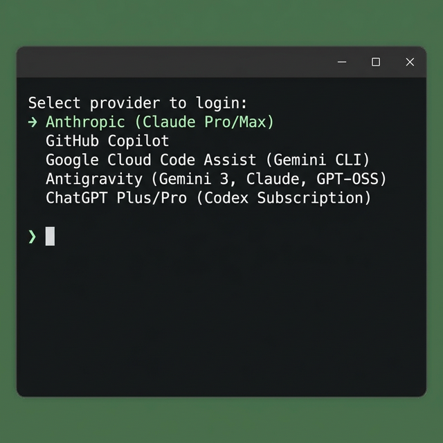

# Pi Setup Guide 🔧

## Step 1 — Launch Pi

Open a terminal and run:

```bash
pi
```

This starts the Pi interactive CLI.

---

## Step 2 — Log In

Once Pi is running, type:

```bash
/login
```

---

## Step 3 — Choose a Provider

A provider selection menu will appear. Use the arrow keys to pick your preferred provider, then press **Enter** to authenticate:



> **Tip:** Choose the provider that matches your active subscription (e.g. Claude Pro/Max, GitHub Copilot, Gemini CLI, etc.).
