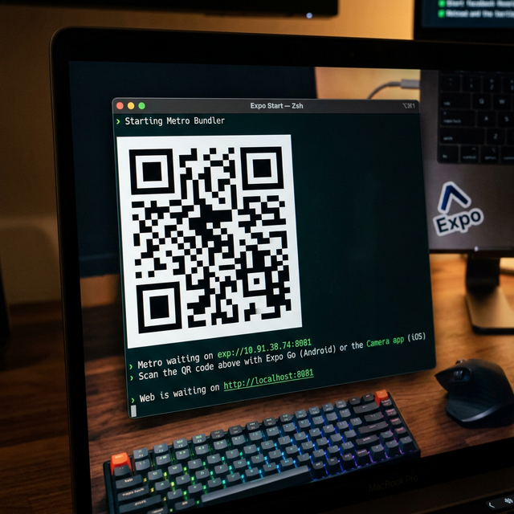

# Quick Start 🚀

## Step 1 — Start the Server

In your first terminal, run:

```bash
npm run dev:cloudflare
```

This starts the proxy server, backend dev server, and a Cloudflare quick tunnel simultaneously. Wait for the tunnel to be ready — you'll see this box appear:

```
┏━━━━━━━━━━━━━━━━━━━━━━━━━━━━━━━━━━━━━━━━━━━━━━━━━━━━━┓
┃ 🚀  EXPO TUNNEL COMMAND — Ready!                    ┃
┣━━━━━━━━━━━━━━━━━━━━━━━━━━━━━━━━━━━━━━━━━━━━━━━━━━━━━┫
┃ Copy & run the command below in another terminal:   ┃
┗━━━━━━━━━━━━━━━━━━━━━━━━━━━━━━━━━━━━━━━━━━━━━━━━━━━━━┛

  EXPO_PUBLIC_SERVER_URL=https://xxx.trycloudflare.com npm run dev:mobile:cloudflare
```

---

## Step 2 — Start the Mobile App

Open a **second terminal** and run the command printed in the box above (the URL will be unique each time):

```bash
EXPO_PUBLIC_SERVER_URL=https://xxx.trycloudflare.com npm run dev:mobile:cloudflare
```

---

## Step 3 — Connect Your Phone

Once Metro Bundler starts, you'll see a **QR code** in the terminal. Scan it with:
- **iOS** — the built-in Camera app
- **Android** — the Expo Go app



> ⚠️ **Before scanning:** Make sure your phone is connected to the **same Wi-Fi network** as the machine running Expo. This is required for the initial QR handshake. Once connected through the Cloudflare tunnel, you can safely switch networks.

> **Note:** Quick tunnels are free and require no Cloudflare account, but they have no uptime guarantee. A new URL is generated each time you start the tunnel.
