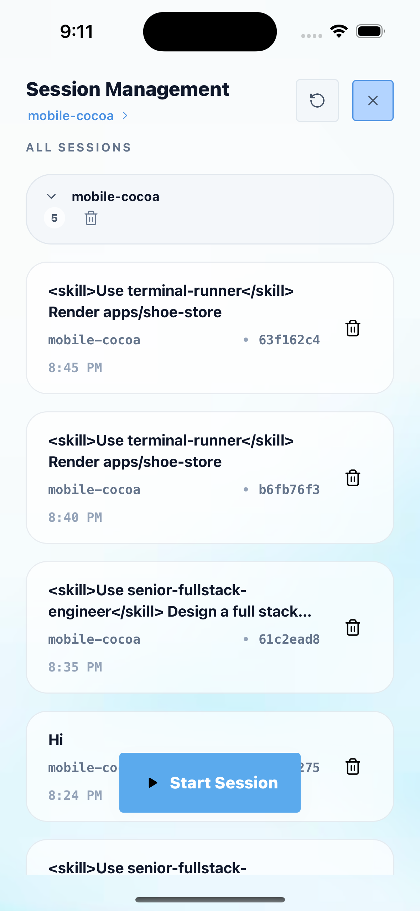
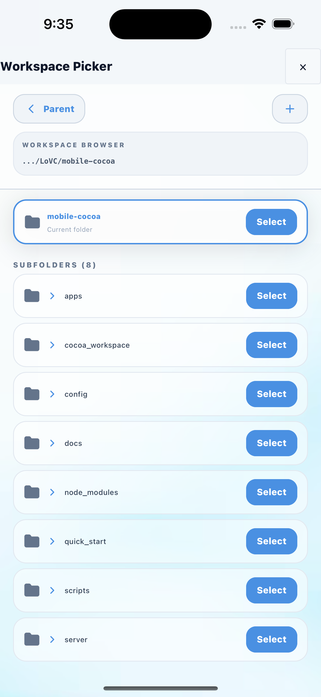

# Session Management & Workspace Selection 🗂️

This guide walks you through **managing coding sessions** and **switching workspaces** in Mobile Cocoa — two powerful features that let you organize parallel work streams and redirect the AI to different projects, all from your phone.

> **Prerequisites:** You should have the app connected and at least one session running (see [Start Your First Mobile App](start_your_first_mobile_app.md)).

---

## Step 1 — Swipe Left to Open Session Management

From the **main chat screen**, perform a **swipe-left gesture** on the workspace path area to reveal the Session Management page.

The green arrow on the home screen indicates the swipe direction — simply drag your finger from right to left across the screen.

> **Tip:** The swipe gesture works from anywhere on the chat page. It's the fastest way to jump into session management without navigating through menus.

  

<em>Swipe left on the home screen to open Session Management.</em>

---

## Step 2 — Browse & Manage Your Sessions

The **Session Management** page displays all your coding sessions, organized by workspace. Here's what you'll see:

### Page Layout
- **Header** — Shows "Session Management" with a **refresh button** (↻) and a **close button** (✕)
- **Current workspace** — Displayed just below the header (e.g. `mobile-cocoa >`)
- **"ALL SESSIONS"** — A section listing every session in the current workspace

### Session Cards
Each session card shows:
- **Prompt preview** — The first line of your original prompt (e.g. *"\<skill\>Use terminal-runner\</skill\> Render apps/shoe-store"*)
- **Workspace name** — Which workspace the session belongs to (e.g. `mobile-cocoa`)
- **Session ID** — A short identifier for the session (e.g. `63f162c4`)
- **Timestamp** — When the session was created (e.g. `8:45 PM`)
- **Delete button** — A 🗑️ icon to remove the session

### Workspace Group
At the top of the session list, you'll see a collapsible **workspace group** (e.g. `mobile-cocoa` with a count badge showing `5`). Tap it to expand/collapse all sessions within that workspace. The group also has its own delete button to bulk-remove all sessions.

### Start a New Session
Tap the blue **"▶ Start Session"** button at the bottom to begin a fresh coding session in the current workspace.

  

<em>The Session Management page with session cards, workspace grouping, and the Start Session button.</em>

---

## Step 3 — Switch Workspace with the Workspace Picker

To redirect the AI to a **different project directory**, tap the **workspace name** link (e.g. `mobile-cocoa >`) at the top of the Session Management page. This opens the **Workspace Picker**.

### Workspace Picker Features
- **Workspace Browser** — Shows the current path (e.g. `.../LoVC/mobile-cocoa`)
- **Current folder** — Highlighted with a blue border, labeled "Current folder" with a **Select** button
- **Subfolders** — Lists all subfolders (e.g. `apps`, `cocoa_workspace`, `config`, `docs`, `scripts`, `server`, etc.) each with their own **Select** button
- **Parent navigation** — Tap **"< Parent"** to navigate up to the parent directory
- **Create folder** — Tap the **"+"** button to create a new directory

### How to Switch
1. **Navigate** through the folder tree using the subfolder list and **Parent** button
2. Find the project directory you want to work in
3. Tap **"Select"** next to the desired folder
4. The AI will now operate in the selected workspace for all future commands

> **Tip:** The Workspace Picker remembers and highlights your current workspace, so you always know where you are. It also pre-loads ancestor folders for instant back-navigation.

  

<em>The Workspace Picker — browse folders and select a new workspace directory.</em>

---

## What Just Happened?

You've just learned how to manage your coding workflow like a pro:

1. ✅ **Swiped left** to access Session Management from the chat screen
2. ✅ **Browsed all sessions** organized by workspace with timestamps and IDs
3. ✅ **Opened the Workspace Picker** to switch the AI to a different project directory

These two features together give you full control over **what** the AI is working on and **where** it's working — enabling you to juggle multiple projects effortlessly from your phone.

---

## Tips & Tricks

- **🔄 Refresh Sessions** — Tap the refresh icon (↻) in the Session Management header to reload the latest sessions from the server
- **🗑️ Clean Up** — Delete old sessions to keep your workspace tidy; use the group-level delete to clear all sessions at once
- **📂 Quick Switch** — Use the workspace link at the top of Session Management as a shortcut to the Workspace Picker
- **▶ Fresh Start** — Tap "Start Session" for a clean conversation without any prior context
- **🔙 Swipe Right** — Swipe right to return to the chat view from Session Management

> **Happy organizing! 🍫📱**
